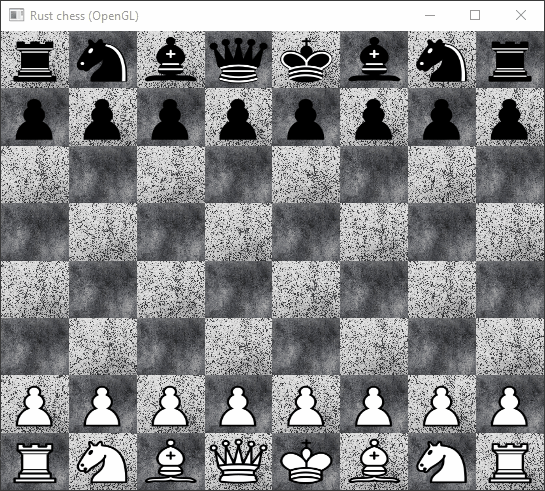

# Requirements
- Windows 2000 Professional or later
- OpenGL version 3.3 or higher

# How to play
The game can be started by running the binary crate:
```
cargo run <ui version>
```
Here `<ui version>` is either `gui` or `cli`.	

Additionally, a [FEN](https://en.wikipedia.org/wiki/Forsyth%E2%80%93Edwards_Notation)-string can be loaded by passing it as an additional parameter.
```
cargo run <ui version> <fen>
```	
This is demonstrated in the [CLI section](<#CLI>).
## GUI

## CLI


The game can be played by the user by entering a move in the form:

```<start row><start column><target row><target column>```

For example, the starting move "e4" would be entered as `2545`. In the future parsing of moves in more intuitive
notation may be supported.

In order to undo / redo moves, type `<` / `>`.

# To do
- [ ] Revert moves in GUI (glfw key callbacks)
- [ ] Save / export FEN strings
- [ ] AI making legal moves